# devbox-panel

A small, self-hosted web panel for the kind of server a solo developer or a tiny
team actually runs: several Node apps under **PM2**, behind **nginx**, with their
databases in **Docker**, deployed by running `make deploy` over SSH.

It turns that routine into a browser tab: click a make target, watch its output
stream live, run several at once, and see the state of every process, container
and vhost on the same screen.

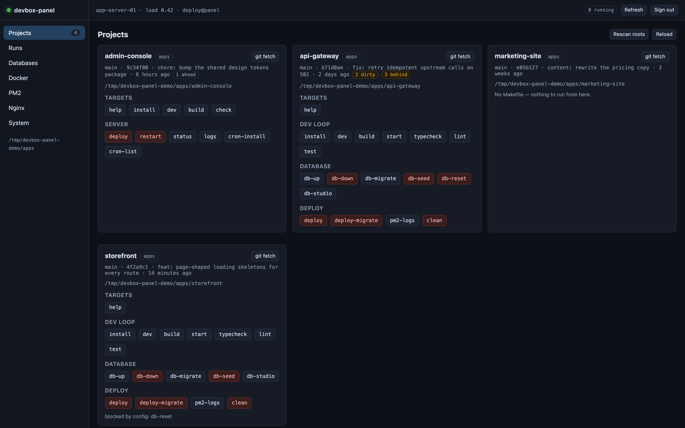

> Every screenshot on this page comes from `make demo`, which runs the panel
> against invented projects, containers, processes and vhosts. No real host,
> domain or deployment appears anywhere in this repository.

## Why this exists

The setup it was written for is ordinary and probably familiar:

- One VPS hosts several **Next.js** applications. Each is a git checkout with a
  `Makefile`; `make deploy` pulls `main`, installs, builds, migrates the database
  and reloads PM2.
- **PM2** keeps them alive — some in cluster mode, some fork — each on its own port.
- **nginx** terminates TLS and proxies each hostname to the right port.
- **Docker** holds the stateful bits: Postgres, Redis, Mongo.

The day-to-day was fine, but it was all rope-and-pulley:

- Deploying meant SSH → `cd` to the right directory → `make deploy` → keep the
  terminal open for four minutes, because closing it kills the build.
- Deploying two projects at once meant two terminals, or tmux, and no shared
  history of what was run and when.
- "Did it actually come back up?" meant `pm2 list`, then `docker ps`, then
  `curl localhost:PORT`, then `tail` on an nginx log in a fourth window.
- Reloading nginx after a config change meant remembering to run `nginx -t`
  first — a habit, not a guarantee.
- None of it was possible from a phone.

So: one authenticated page that does all four, streams output in real time, keeps
a history with full logs, and refuses to do anything that is not on an allowlist.

**Constraints I set for myself**, because a panel like this is a beautiful target:

1. **Never build a shell string.** Every command is an argv array. A project name
   or target coming from the browser can never become part of a command line.
2. **Allowlist everything.** Only targets parsed out of that project's own
   Makefile, only containers and processes that exist right now, only the handful
   of docker/pm2 verbs the code names explicitly.
3. **Minimal root.** Exactly one `sudoers` line, pointing at one script that
   understands six verbs and validates its own arguments.
4. **Degrade, do not crash.** No Docker group? The Docker tab says exactly that
   and everything else keeps working.
5. **No build step on the server.** Deploying the panel is `git pull` +
   `npm ci --omit=dev` + `pm2 reload`. Two runtime dependencies, no bundler, no
   framework, no toolchain to rot.

## What it does

### Run make targets, watch them live

Each project's Makefile is parsed into buttons — grouped by the `# ---- section`
banners, with the `## comment` after a target as its tooltip. Several targets can
run at once; each gets a tab in the terminal dock; every run is cancellable.

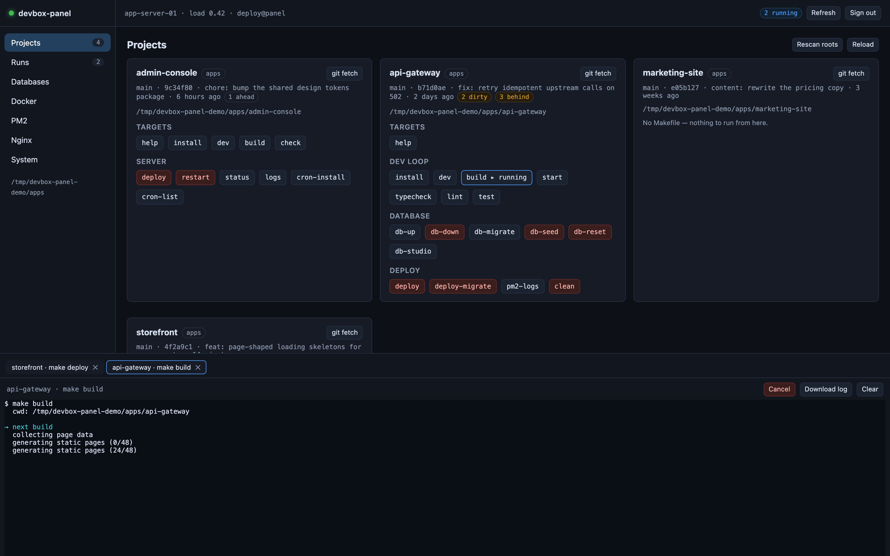

Cancelling signals the whole **process group**, because `make` spawns npm which
spawns next — killing only the make PID leaves the build running and the port held.

Targets whose names look destructive (`deploy`, `reset`, `drop`, `down`, `clean`,
`stop`, …) are marked and require a confirmation; the API returns `428` without it.
Targets can also be removed entirely per project in the config, which is how
`db-reset` disappears from a production checkout.

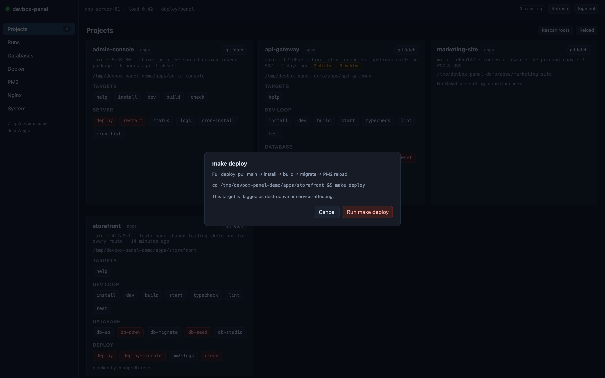

### Keep the history

Every command the panel has ever run — make targets, git fetches, docker and pm2
actions — with status, exit code, duration and its complete log, downloadable.

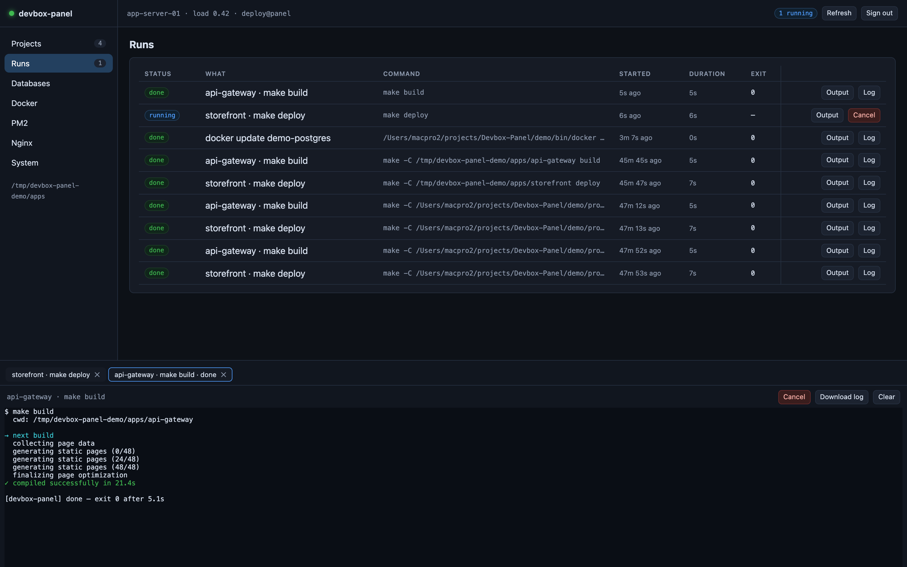

Jobs are spawned **detached**, so restarting or updating the panel does not kill a
running deploy. Those jobs come back marked `orphaned`: the log file is complete,
only the live stream is gone.

### Databases — any engine, container or host service

Databases are found two ways: containers matched by image, and host services matched
by unit name. Everything found gets the same outside view — live usage against its
limit, with the bar going amber then red as it approaches.

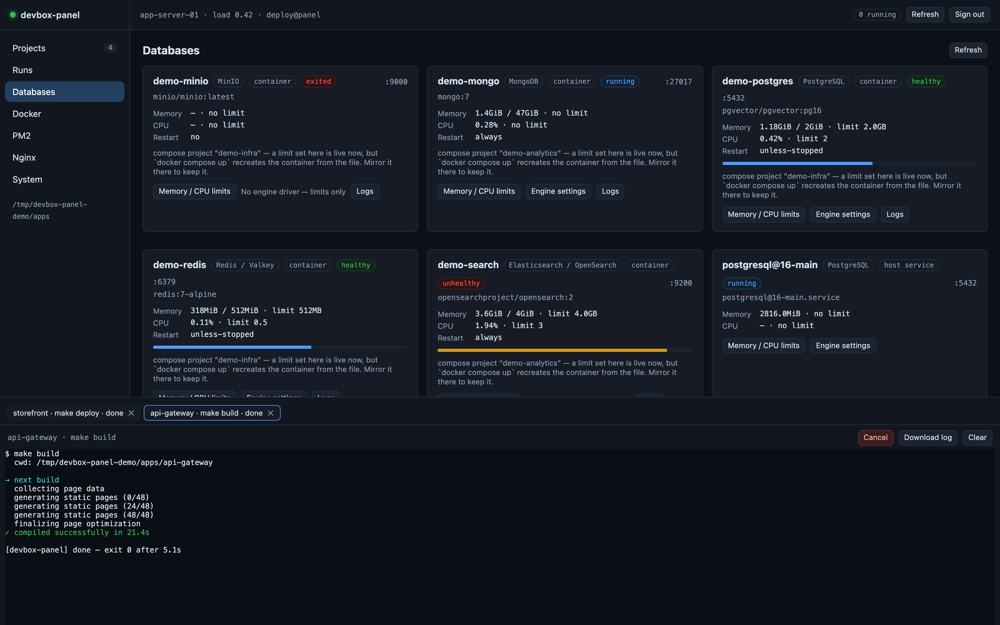

**Memory and CPU limits are editable from here**, for every engine equally. On a
container that is `docker update`: live, no recreate, no downtime. On a host service
it is `systemctl set-property`, which writes a drop-in so the limit also survives a
reboot. If the container belongs to a compose project the dialog says so, because
`docker compose up` will later recreate it from the file and undo the change.

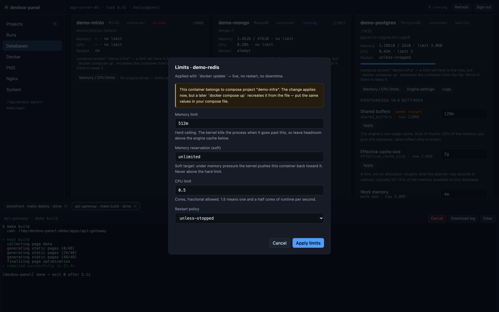

**Engines with a driver also expose their own memory knobs** — the part a container
limit alone cannot do. Postgres with 4 GB of `shared_buffers` inside a 2 GB container
is an OOM kill waiting for traffic; Redis with no `maxmemory` will happily grow until
the same thing happens. Shipped drivers:

| Engine | Read | Write | Notes |
|---|---|---|---|
| PostgreSQL (incl. pgvector, TimescaleDB, PostGIS) | `pg_settings` | `ALTER SYSTEM` + reload | 12 settings: shared buffers, work_mem, cache size, WAL, planner costs. Survives restarts via `postgresql.auto.conf`. |
| MySQL / MariaDB / Percona | `global_variables` | `SET PERSIST`, falling back to `SET GLOBAL` | Buffer pool, per-connection buffers, table cache, IO capacity. |
| Redis / Valkey / KeyDB | `CONFIG GET` | `CONFIG SET` + `CONFIG REWRITE` | maxmemory and the eviction policy — the two that decide whether a cache degrades or dies. |
| MongoDB | `serverStatus` | `setParameter` | WiredTiger cache size, live. Says plainly that Mongo will not persist it. |

Anything else the panel recognises — OpenSearch, ClickHouse, Cassandra, InfluxDB,
Neo4j, CouchDB, Memcached, CockroachDB, Qdrant, Milvus, Weaviate, Meilisearch,
Typesense, etcd, Kafka, RabbitMQ, MinIO, SQL Server, Oracle — is listed with live
usage and editable limits, and says "no engine driver" instead of pretending.

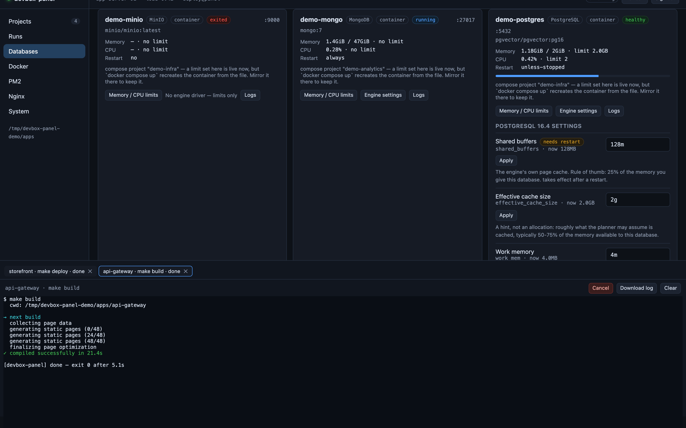

Every value is parsed and re-serialised by the panel before it goes anywhere: a
setting name must be one the driver declares, a size is turned into a number and
formatted back out, an enum must be one of its options. `work_mem` accepts `16m`;
it does not accept `16m'; DROP DATABASE x; --`.

Database passwords are never stored. Container engines are reached with
`docker exec` over the container's own loopback socket, where the engine trusts a
local connection; MySQL is the exception and its root password is read from the
container's own environment and passed through `MYSQL_PWD` for exactly one exec —
never logged, never returned to the browser.

### Docker

Containers with state, health, ports, current limits and compose project;
start/stop/restart; `docker logs -f` streamed into the same terminal dock; an
on-demand CPU/memory sample. The same limits editor as the Databases tab is here
too, for every container — not just the databases.

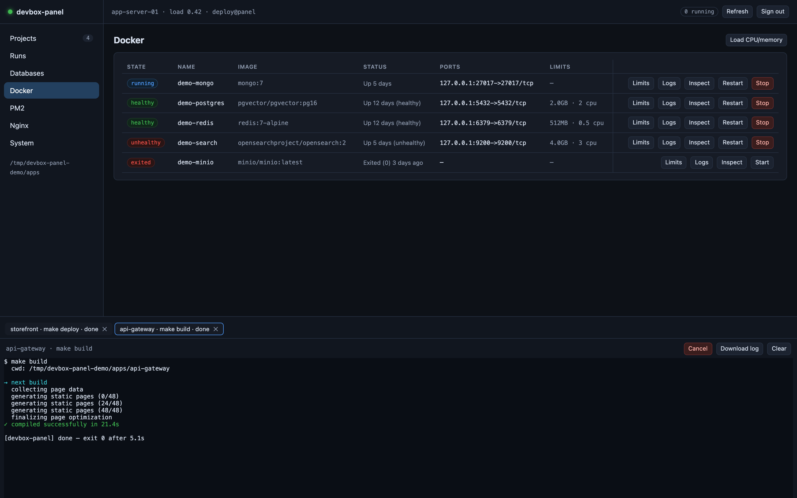

### PM2

Status, mode, uptime, restart count, CPU, memory, port and working directory;
reload (zero-downtime in cluster mode), restart, stop, start; live logs.

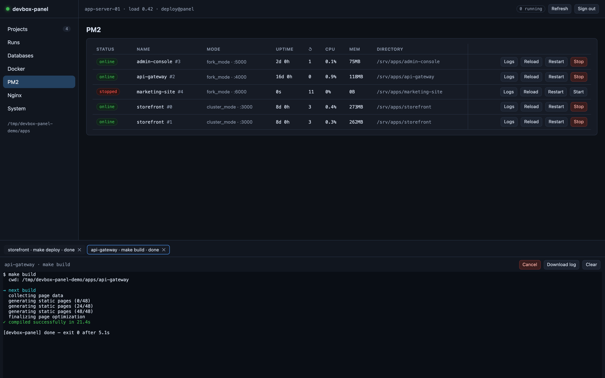

### Nginx

`nginx -t` on demand, a reload that **only runs if the test passes**, the full
vhost → upstream map with whether each host is TLS-terminated and whether it is
restricted or public, the config file itself, and a tail of any log.

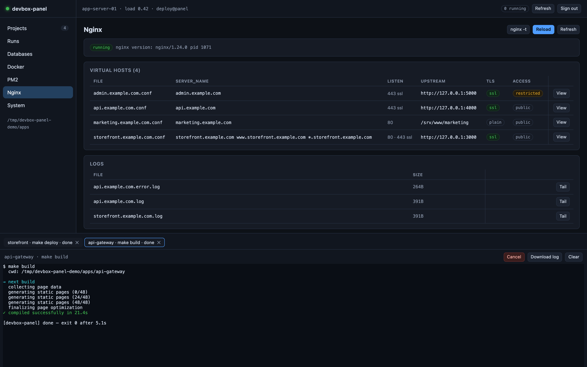

### System

Load, memory, disks, listening ports, and what the panel itself is running as.

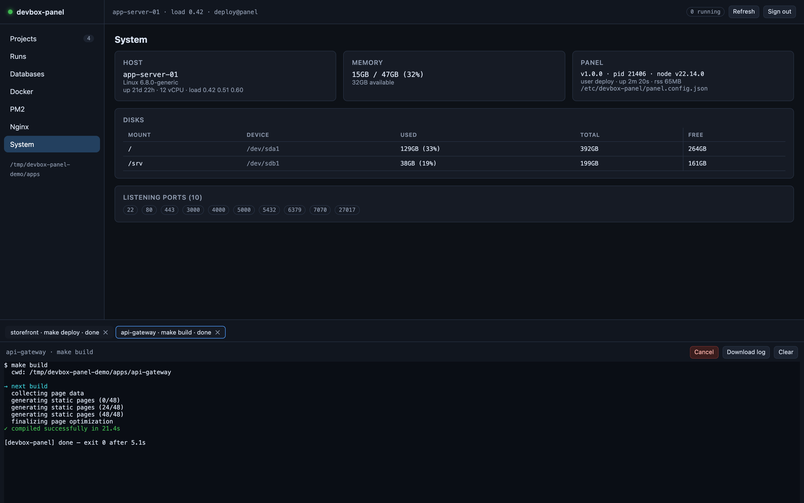

## Try it without a server

```bash
npm install
make demo     # -> http://127.0.0.1:7071
```

Demo mode serves invented projects and stubs `git`, `docker`, `pm2` and the nginx
helper (see `demo/bin/`). It skips the login — and because that is exactly the
kind of shortcut that ends up in production by accident, the panel **refuses to
start in demo mode on any address other than loopback**.

`make screenshots` regenerates the images above from that demo, driving headless
Chrome over the DevTools protocol with the `ws` dependency the panel already ships.

## Security

This panel executes `make`, `docker`, `pm2` and `nginx -s reload` on your server.
**Anyone who gets in owns the box.** What it does about that:

| Control | Detail |
|---|---|
| Password login | scrypt hash in `.env`, never in git. Minimum 10 characters. |
| Session cookie | HMAC-signed, httpOnly, SameSite=Lax, `Secure` behind TLS, 12h expiry. |
| Brute force | 5 failed logins per IP per 15 minutes, then locked out. |
| CSRF | Every mutating request must echo the session's token in `X-Panel-CSRF`. |
| Websocket | The upgrade is rejected without a valid session cookie. |
| No shell strings | Commands are argv arrays; a name can never become a command. |
| Allowlists | Targets from the parsed Makefile, containers/apps from the live list, verbs from the code. |
| Deny list | `projectOverrides.<project>.deny` removes targets from the UI *and* the API. |
| Confirmation | Dangerous targets need an explicit confirm (HTTP 428 otherwise). |
| Guarded reload | `nginx -s reload` only after `nginx -t` passes. |
| Root surface | Two sudoers lines, for two scripts with fixed verbs and their own argument validation — the nginx helper, and a database helper for host services (systemd limits, and Postgres settings from an allowlist). Containerised engines need no root at all. |
| Limit validation | Sizes and CPU counts are parsed into numbers, bounded (≥6 MiB, ≤ host RAM), and re-serialised before they reach `docker update` or `systemctl`. |

It binds `127.0.0.1` by default — nginx is the only way in. The vhost template
carries a commented-out `allow`/`deny` block if you want a second lock.

## Install on a server

Assumes the panel runs as the user that owns the app checkouts and the PM2 daemon
(`deploy` in the examples).

```bash
# 1. as that user
git clone https://github.com/<you>/devbox-panel.git && cd devbox-panel
npm ci --omit=dev

# 2. root pieces: nginx helper + sudoers + /etc/devbox-panel/panel.config.json
sudo bash deploy/install.sh --user deploy

# 3. secrets (never committed)
npm run gen-secret        # -> PANEL_SESSION_SECRET in .env
npm run hash-password     # -> PANEL_PASSWORD_HASH in .env

# 4. edit /etc/devbox-panel/panel.config.json — roots, deny lists, pm2 bin

# 5. run it (systemd is preferred — see the note below)
sudo systemctl enable --now devbox-panel

# 6. publish it
sudo cp deploy/nginx-public-domain.conf /etc/nginx/conf.d/panel.<domain>.conf
sudo sed -i 's/PANEL_DOMAIN/panel.<domain>/g' /etc/nginx/conf.d/panel.<domain>.conf
# issue a certificate, then:
sudo /usr/local/bin/devbox-panel-nginx reload
```

**systemd or PM2?** The repo ships both a unit file and a PM2 ecosystem file, but
prefer systemd when the panel manages that same PM2 daemon: as a PM2 app the panel
is a child of the thing it restarts, so `pm2 update` — or a stray "restart all" —
takes the panel down with it. The unit also grants the `docker` supplementary
group directly, and uses `KillMode=process` so restarting the panel does not sweep
away the detached deploys it started.

`deploy/install.sh` also offers to add the panel user to the `docker` group — that
group is root-equivalent, and the script says so before doing it.

Updating later: `make deploy` in the checkout, or click `self-update` in the panel
— that target detaches itself, because reloading the panel from inside the panel
would kill the job streaming its own output.

There is a tailnet-only vhost template too (`deploy/nginx-tailnet.conf`) if you
would rather the panel never be reachable from the public internet at all.

## Configuration

`/etc/devbox-panel/panel.config.json` (or `config/panel.config.json` locally):

| Key | Meaning |
|---|---|
| `port`, `host` | Listen address. Keep `127.0.0.1` and let nginx do TLS. |
| `dataDir` | Job logs and history. Relative paths resolve against the repo. |
| `jobs.maxConcurrent` | Refuses to start more than this many at once (default 6). |
| `jobs.bufferBytes` | In-memory tail kept per job for late viewers (default 512 KB). |
| `jobs.historyLimit` | How many runs to keep; trimmed runs lose their log file too. |
| `roots[]` | `{ label, path, user, enabled }`. `user` runs that root's targets via `sudo -u <user> make`. |
| `projectOverrides` | Per project: `deny` (targets removed entirely), `danger` (extra confirm patterns). |
| `dangerPatterns` | Substrings that mark a target as destructive/service-affecting. |
| `pm2.bin` | `auto` searches `~/.npm-global/bin`, `/usr/local/bin`, nvm. Set a full path if it guesses wrong. |
| `pm2.home` | Sets `PM2_HOME` when the daemon does not live in the panel user's home. |
| `docker.allowStop` | `false` makes the Docker tab start/restart-only. |
| `nginx.helper`, `nginx.sudo`, `nginx.allowReload` | Helper path, whether to sudo it, whether reloads are allowed. |
| `databases.enabled` | Turns the Databases tab off entirely. |
| `databases.helper`, `databases.sudo` | The root helper used for host-service databases (systemd limits, Postgres settings). Containers never use it. |
| `databases.scanServices` | Set `false` to look only at containers and skip the systemd unit scan. |

Secrets live in `.env`: `PANEL_PASSWORD_HASH`, `PANEL_SESSION_SECRET`, and
optionally `PANEL_PORT`, `PANEL_HOST`, `PANEL_BEHIND_PROXY`, `PANEL_SESSION_HOURS`,
`PANEL_CONFIG`.

### Running targets as another user

A root with `"user": "someone"` makes the panel run `sudo -n -u someone /usr/bin/make …`,
which needs `deploy/sudoers.devbox-panel-devhop`. Understand what that grants:
`make` runs whatever the Makefile says, so it is arbitrary code as that user — and
if that user has passwordless sudo, it is a path to root. Such roots ship
**disabled**; turn one on only if you accept the bridge.

## Architecture

```
src/
  server.js            composition root: express + ws + pollers
  config.js            config file + .env; refuses to boot without a password hash
  auth.js              scrypt hashing, signed sessions, login rate limiter
  bus.js               channel pub/sub
  streams.js           ref-counted pollers (pm2/docker/system) and follow processes (logs)
  ws.js                one websocket, many channels, cookie-authenticated
  jobs/job-manager.js  spawn, stream, cancel, persist, trim
  routes/api.js        the REST surface
  services/            projects, makefile, docker, pm2, nginx, system, databases
  services/dbdrivers/  one module per engine: postgres, mysql, redis, mongodb
  util/exec.js         argv-only spawn helpers, sudo hop, login shell
public/                vanilla ES modules + xterm.js served from node_modules
demo/                  fake CLIs, fixtures, screenshot driver
deploy/                nginx helper, sudoers, vhost templates, pm2 ecosystem, installer
```

Websocket channels: `jobs`, `job:<id>`, `pm2`, `docker`, `system`,
`pm2logs:<app>`, `dockerlogs:<container>`, `nginxlog:<file>`. Pollers and follow
processes are reference-counted, so an idle panel spawns nothing on the server —
open the Docker tab and a `docker ps` loop starts; leave it and the loop stops.

Two runtime dependencies: `express` and `ws`. `@xterm/xterm` is served straight
from `node_modules`, so there is nothing to build or bundle.

## Troubleshooting

| Symptom | Cause / fix |
|---|---|
| Docker tab: "no access to the docker socket" | Panel user is not in the `docker` group, or the process predates the change. `usermod -aG docker deploy && pm2 restart devbox-panel`. |
| Nginx tab: "sudo refused" | `/etc/sudoers.d/devbox-panel` missing or names a different user. Re-run `deploy/install.sh --user <user>`. |
| PM2 tab: "pm2 not found" | pm2 is not on the panel's PATH (a login shell does not read `~/.bashrc` non-interactively). Set `pm2.bin` to the full path. |
| PM2 list is empty but apps are running | The daemon belongs to another user. Run the panel as that user, or set `pm2.home`. |
| Logs stall or arrive in bursts | nginx buffering: the vhost needs `proxy_buffering off`, and `proxy_cache off` if a cache is enabled at the http level. |
| Websocket never connects (page loads, dot is red) | The vhost is missing the `Upgrade`/`Connection` headers, or `$connection_upgrade` is undefined. The template shows the `map` to add. |
| `make deploy` works over SSH but fails here | The recipe depends on an interactive-shell PATH. The panel prepends `~/.npm-global/bin` and `/usr/local/bin`; anything else belongs in the Makefile. |
| Databases tab: "no engine driver" | The image is recognised but has no driver — limits still work, engine settings do not. Adding one is a single file in `src/services/dbdrivers/`. |
| Engine settings say the client is missing | The driver talks to the engine through its own CLI inside the container (`psql`, `redis-cli`, `mongosh`). Slim images sometimes ship without it. |
| A limit reverts after a deploy | The container belongs to a compose project and was recreated. Put the limits in the compose file — the panel warns about exactly this before applying. |
| Host-service database shows limits but no settings | Only Postgres is supported through the root helper so far; other host engines get limits only. |
| Reload says `unknown directive "http2"` | nginx < 1.25 takes HTTP/2 on the listen line, not as its own directive. The shipped templates use the compatible form; if you edited yours, use `listen 443 ssl http2;`. The reload is refused rather than applied — the running config is untouched. |

## Tests

```bash
npm test
```

Covers the Makefile parser, the nginx vhost parser, password/session/CSRF/rate-limit
logic, the resource-limit parser (including the values it must refuse), the database
drivers (image/unit matching, per-kind setting validation, and that each driver
re-serialises what it was given rather than passing it through), and the job manager:
exit codes, process-group cancellation, the concurrency cap, history trimming, and how
a restart reports jobs it left running.

## License

MIT
